## glua-SharpVector: Performance Test
 Using [gluafuncbudget](https://gist.github.com/noaccessl/2336bb390aca15bc7ba50d2c9d966daa#file-gluafuncbudget-lua)

 CPU: i7-3770

 OS: Windows 10

 Benchmark Code: [sharpvec_perftest.lua](./sharpvec_perftest.lua)

#### LuaJIT 2.1.0-beta3 (x86-64 Branch)

 
Results

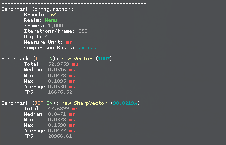

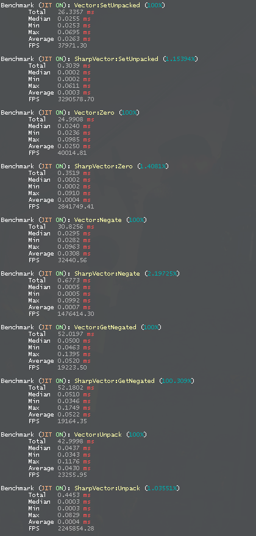

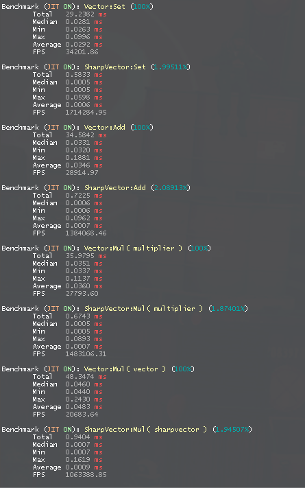

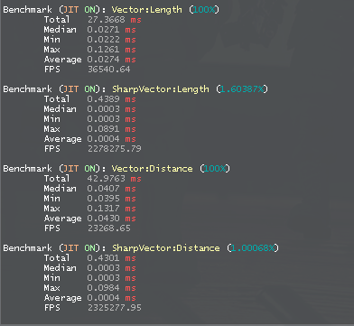

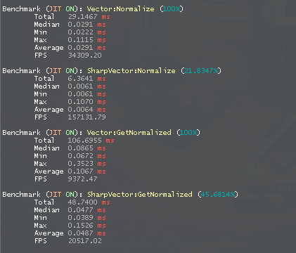

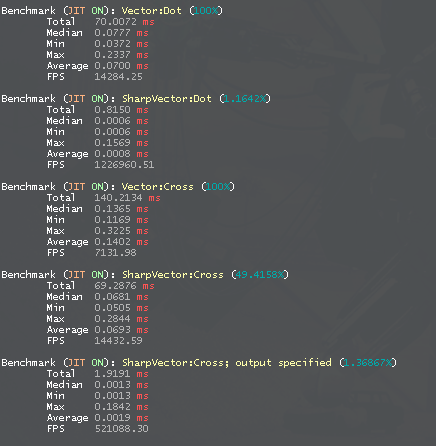

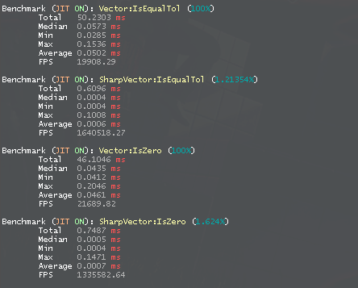

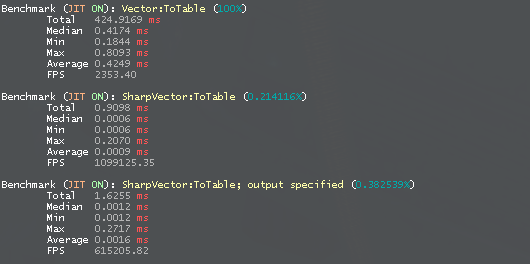

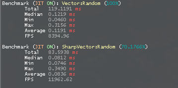

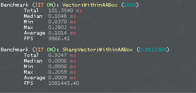

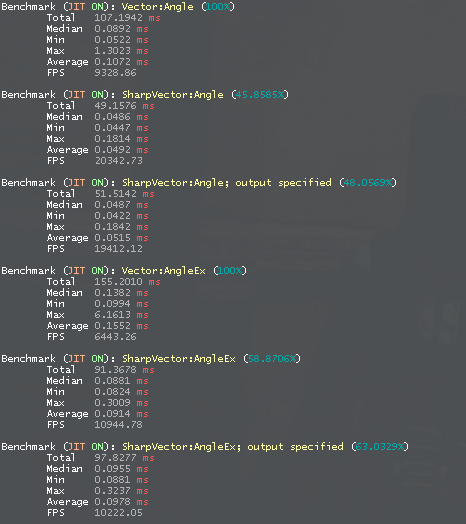

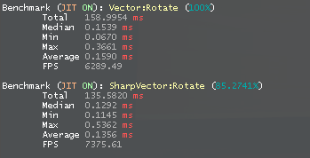

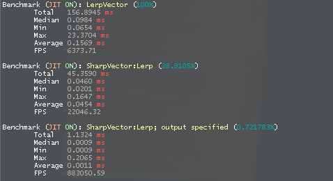

#### LuaJIT 2.0.4

 
Results

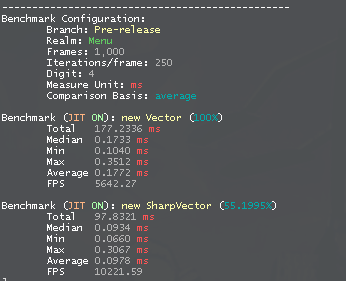

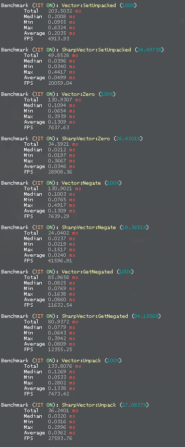

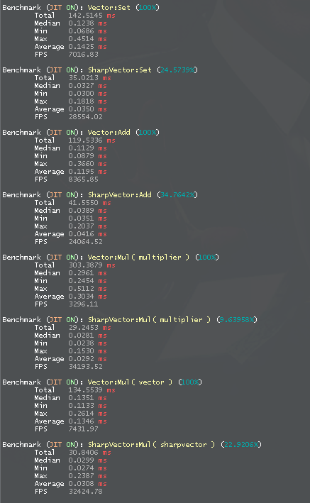

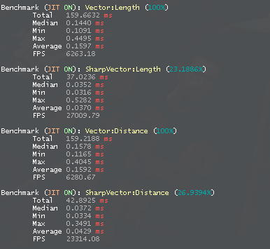

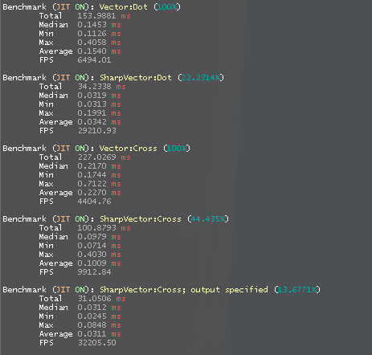

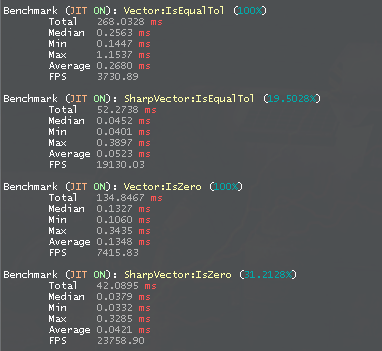

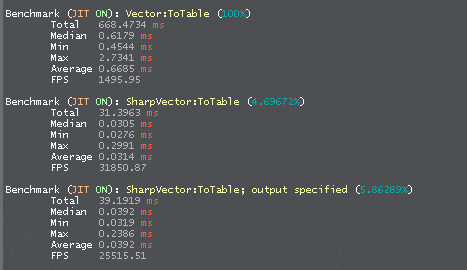

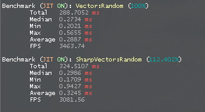

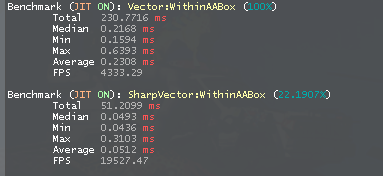

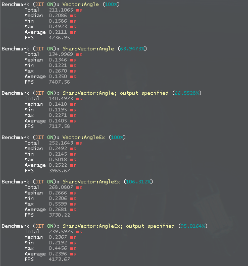

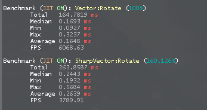

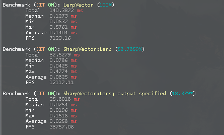

---

 Functions excluded from testing and why:
 * Functions using metamethods declared in the engine
	* As internally metamethods from `C` are called, equalizing the execution time with those metamethods

 * `Sub`
	* As it's the same addition but with negative numbers

 * `Div`
	* As it's the same multiplication but inverted

 * `LengthSqr`, `Length2D`, `Length2DSqr`, `DistToSqr`, `Distance2D`, `Distance2DSqr`
	* `Length` & `Distance` must be enough as those ones are obviously cheaper in calculations

 * `ToGModVector` & `Vector:Sharpened`
	* No twin function

 * `ToColor`
	* Mostly identical to `Vector:ToColor`
